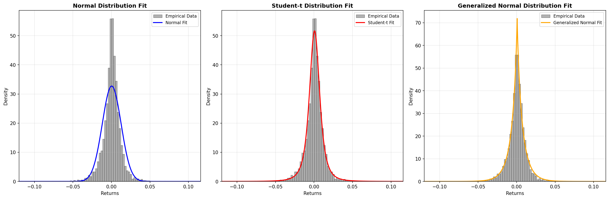
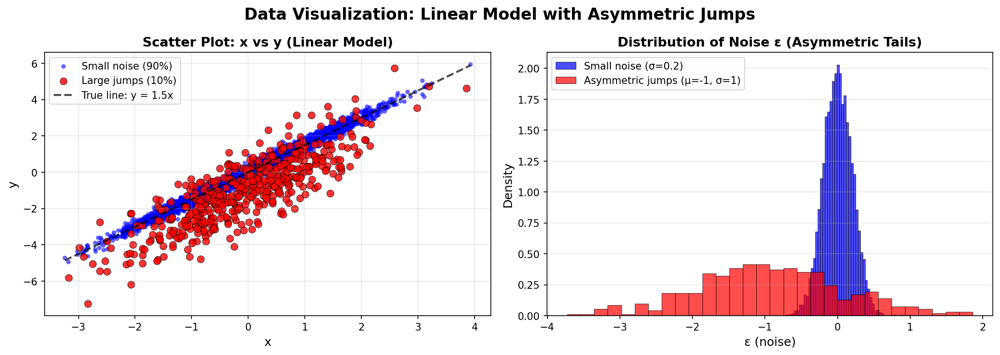
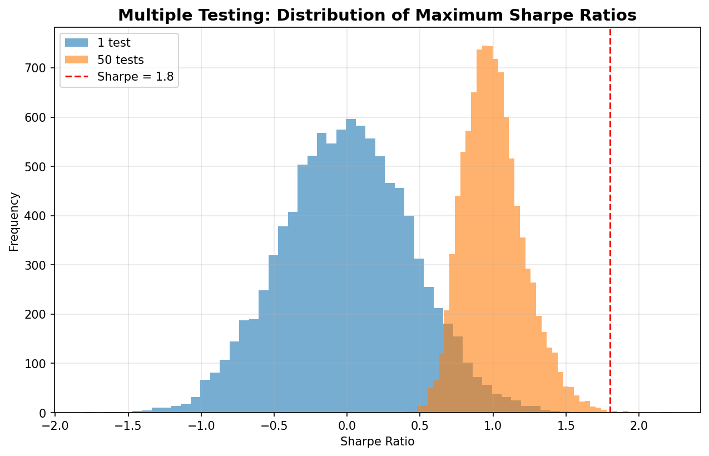
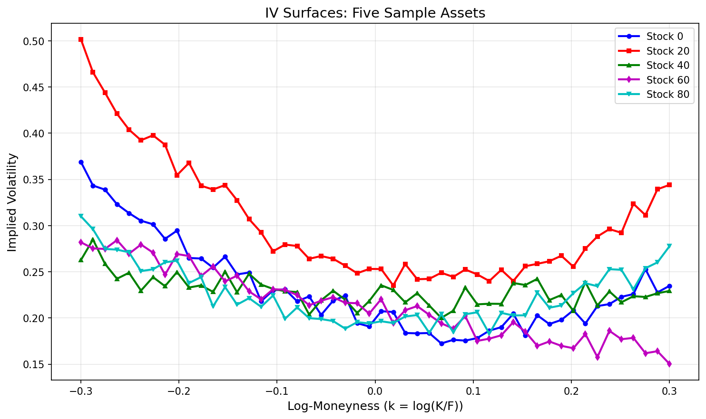
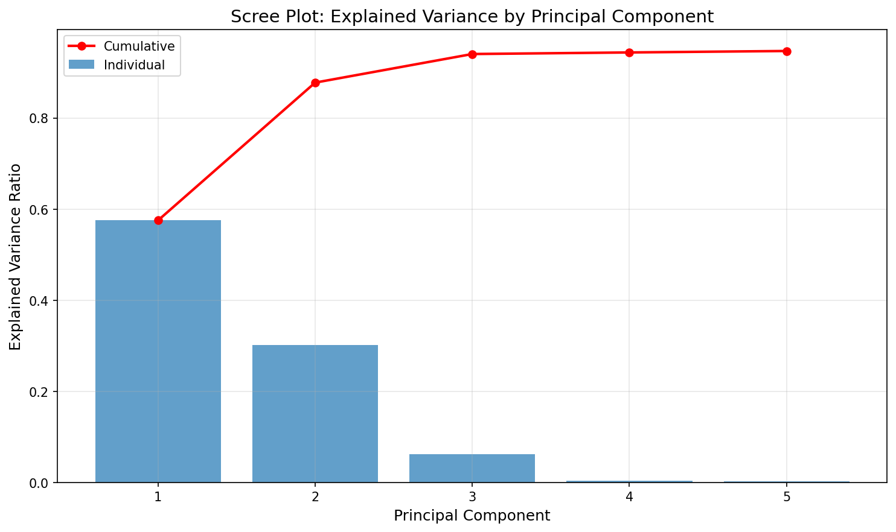
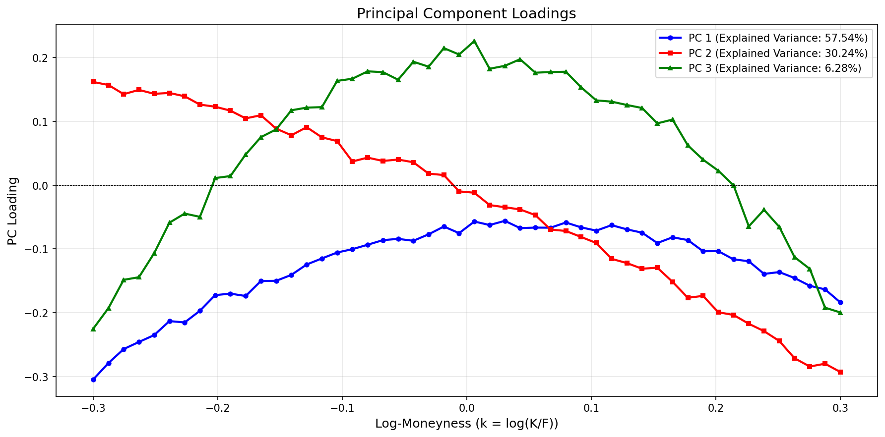

# Statistical Analysis Summary

## 1. Fat Tail Analysis (`fat_tail.ipynb`)

### Objective
Analyze the fat-tailed nature of SPX (S&P 500) returns and compare different distribution models to assess tail risk.

### Key Findings

#### Risk Metrics (99% Confidence Level)

| Method | Metric | Value |
|--------|--------|-------|
| Empirical | VaR 99% | -3.42% |
| Empirical | ES 99% | -4.92% |
| Normal | VaR 99% | -2.81% |
| Normal | ES 99% | -3.22% |
| Student-t | VaR 99% | -3.49% |
| Student-t | ES 99% | -5.78% |

**Key Insight**: The Normal distribution significantly underestimates tail risk:
- **VaR gap**: Normal underestimates by 0.62% compared to empirical
- **ES gap**: Normal underestimates by 1.70% compared to empirical

#### Distribution Fitting Results

| Distribution | Parameters | AIC | KS Statistic | KS p-value |
|--------------|------------|-----|--------------|------------|
| **Student-t** | df = 2.65 | -41,005.64 | 0.0176 | 0.0348 |
| **Generalized Normal** | β = 0.87 | -41,003.85 | 0.0179 | 0.0297 |
| **Normal** | μ = 0.000314, σ = 0.012193 | -39,102.22 || 0.0923 | 0.0000 |

**Conclusion**: 
- **Student-t distribution** (df = 2.65) provides the best overall fit with the lowest AIC

### Visualizations

1. **Histogram with Fitted PDFs**: Three subplots showing empirical return distribution overlaid with fitted PDFs for Normal, Student-t, and Generalized Normal distributions. The Student-t and Generalized Normal distributions better capture the fat tails of the empirical data.

2. **Q-Q Plots**: Three Q-Q plots comparing empirical quantiles against theoretical quantiles for each distribution. The Student-t and Generalized Normal show better alignment with the diagonal reference line, especially in the tails.

---

## 2. Loss Function Comparison (`loss_function.ipynb`)

### Objective
Compare the performance of different loss functions (MSE/OLS, Huber, MAE) on data with asymmetric jumps and outliers.

### Data Generation
- **Model**: y = 1.5x + ε
- **90% of the time**: Small Gaussian noise N(0, 0.2²)
- **10% of the time**: Large asymmetric jump N(-1, 1²)
- **Sample size**: 5,000 observations

### Model Performance

| Model | β̂ (coefficient) | Intercept | MSE (all data) | MAE (all data) | MSE (middle only) |
|-------|------------------|-----------|----------------|----------------|-------------------|
| **OLS (MSE)** | 1.5082 | -0.0901 | 0.2146 | 0.2663 | 0.0485 |
| **Huber Loss** | 1.5016 | -0.0170 | 0.2199 | 0.2570 | 0.0403 |
| **MAE** | 1.5016 | -0.0170 | 0.2199 | 0.2570 | 0.0403 |

### Key Insights

1. **Overall MSE**: OLS achieves the lowest MSE (0.2146) when including all data points, as it directly optimizes for this metric.

2. **Normal Day Performance**: Huber and MAE losses achieve **lower MSE on typical data points** (0.0403 vs 0.0485), demonstrating better robustness to outliers.

3. **Coefficient Estimation**: 
   - OLS coefficient (1.5082) is slightly biased away from the true value (1.5) due to outliers
   - Huber and MAE recover the true coefficient more accurately (1.5016)

**Conclusion**: Robust loss functions (Huber, MAE) are preferred when outliers are present but accurate predictions for typical observations are more important than overall MSE minimization.

### Visualizations

1. **Scatter Plot**: Shows the relationship between x and y, with small noise points (90%) in blue and large jumps (10%) in red. The true line y = 1.5x is overlaid.

2. **Noise Distribution Histogram**: Displays the distribution of ε, showing the bimodal nature with small noise (σ = 0.2) and asymmetric jumps (μ = -1, σ = 1).

---

## 3. Multiple Testing Problem (`multiple_test.ipynb`)

### Objective
Demonstrate how multiple testing increases the probability of observing spurious high Sharpe ratios when all strategies are pure noise.

### Simulation Setup
- **Time period**: T = 1,260 days
- **Daily volatility**: σ = 0.01
- **Number of simulations**: M = 10,000
- **Test scenarios**: 1 test vs 50 tests

### Results

| Scenario | P(Sharpe ≥ 1.8) |
|----------|-----------------|
| **1 test** | 0.0% (0 out of 10,000) |
| **50 tests** | 0.17% (17 out of 10,000) |

### Key Insight

When testing multiple strategies simultaneously, the probability of observing spurious high Sharpe ratios increases dramatically, even when all strategies are pure noise (null hypothesis is true).

**Conclusion**: Multiple testing significantly increases the probability of false discoveries. Proper multiple testing corrections (e.g., Bonferroni, FDR) are essential when evaluating multiple strategies.

### Visualization

**Histogram Comparison**: Overlapping histograms showing the distribution of maximum Sharpe ratios for 1 test vs 50 tests. A vertical red dashed line marks Sharpe = 1.8. The distribution for 50 tests shows a longer right tail, indicating higher probability of extreme values.

---

## 4. Principal Component Analysis (`pca.ipynb`)

### Objective
Perform PCA on synthetic implied volatility (IV) surfaces to identify the main factors driving volatility structure.

### Data Structure
- **Surface matrix**: 100 assets × 50 strikes (log-moneyness from -0.3 to 0.3)
- **Basis functions**: Level, skew, curvature, and fourth-order terms
- **Noise**: Small Gaussian noise added to each surface

### PCA Results

#### Explained Variance

| Principal Component | Explained Variance | Cumulative Variance |
|---------------------|-------------------|---------------------|
| **PC1** | 57.5% | 57.5% |
| **PC2** | 30.2% | 87.7% |
| **PC3** | 6.3% | **94.0%** |
| PC4 | 0.3% | 94.4% |
| PC5 | 0.3% | 94.7% |

**Key Finding**: The first 3 principal components explain **94.0%** of the total variance, indicating that IV surfaces can be effectively represented by just three factors.

### Trading Applications

#### 1. Relative-Value (Cross-Sectional) Strategies
- Compare PCA scores across assets
- Identify mispricings (e.g., skew too steep vs peers)
- Trade relative misalignments in volatility structure

#### 2. Time-Series Strategies
- Model PCA scores as state variables
- Trade mean reversion in factor loadings
- Identify and trade regime shifts in volatility structure

### Visualizations

1. **Sample IV Surfaces**: Plot showing five sample IV surfaces across different assets, demonstrating the variation in volatility structure (level, skew, curvature).

2. **Scree Plot**: Bar chart showing individual explained variance for the first 5 PCs, with a cumulative line overlay. Clearly shows that PC1 and PC2 dominate.

3. **Principal Component Loadings**: Plot of the first 3 PC loadings as functions of log-moneyness (k). These show:
   - **PC1**: Likely captures the overall level of volatility
   - **PC2**: Likely captures skew (asymmetric structure)
   - **PC3**: Likely captures curvature (smile shape)

